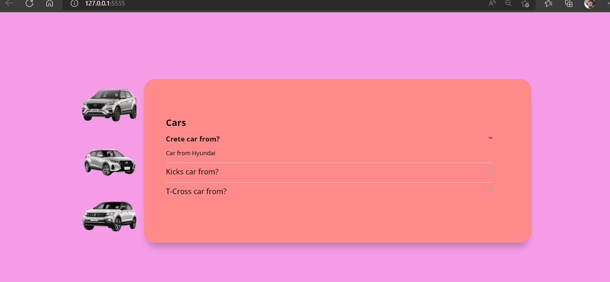
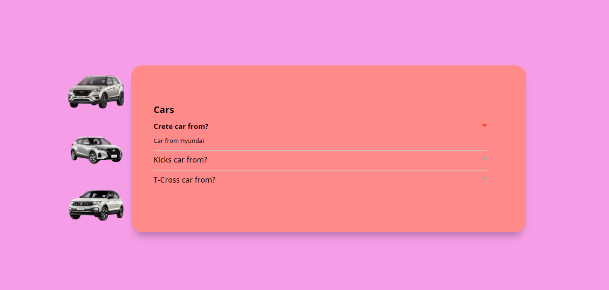

### Project list cars

### Clicking on a question should play an accordion animation to open the item and show the hidden text, and the arrow should change color.
### When clicking on an item to open it, all other items must be closed.

### Projeto lista carros
### Ao clicar em uma pergunta deve acontecer uma animação de acordeon para abrir o item e mostrar o texto escondido, e a seta deve mudar de cor.
### Ao clicar em um item para abri-lo todos os outros itens devem ser fechados.

[]

[]

#### Tecnologias Utilizadas

    
  
  

  ### Márcia